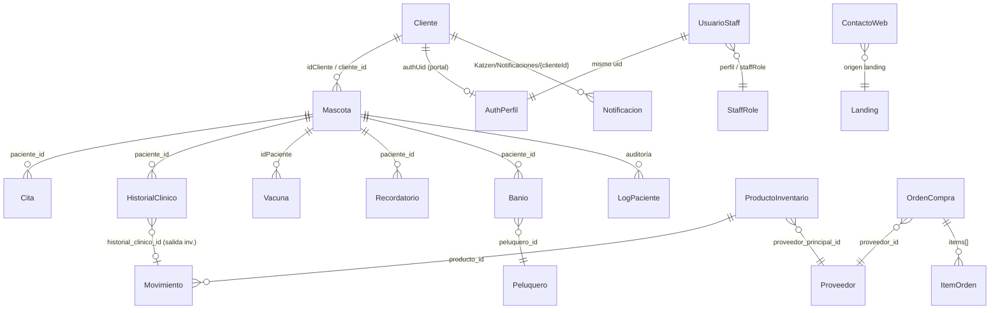
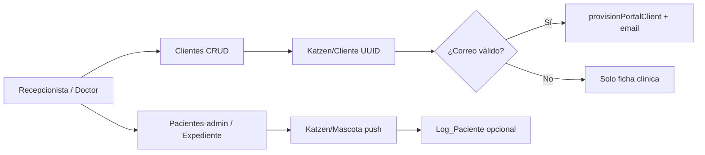
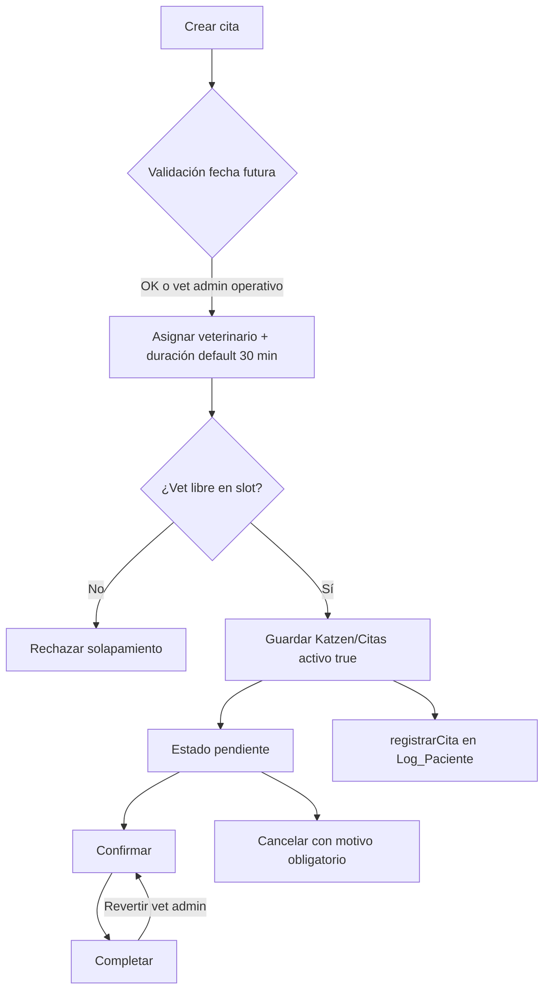
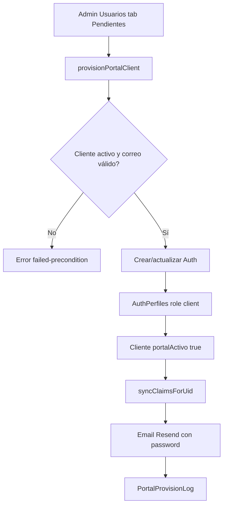
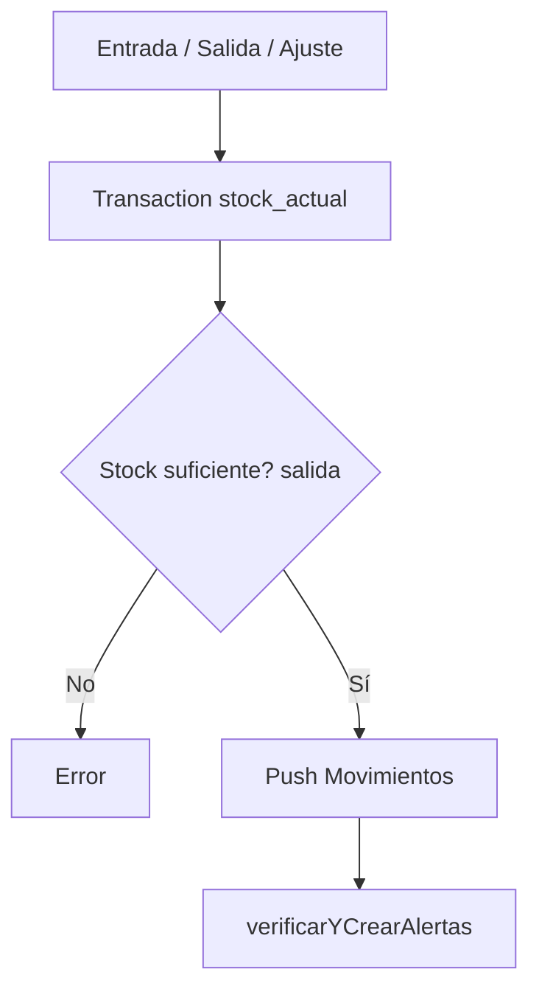

# Contexto de dominio — KatzenVet Web

Documento vivo de lógica de negocio inferida del código, reglas RTDB y Cloud Functions.  
**Última revisión:** 2026-08-26 · **Fuente:** inspección de código + decisiones de negocio (Luis Alfonso Niño Martínez) · actualización **022 done (A–D)** automatización costos/ops + pensión.

---

## 1. Visión del producto

KatzenVet es el sistema web de una clínica veterinaria con tres superficies:

| Superficie | Ruta base | Usuarios | Propósito |
|------------|-----------|----------|-----------|
| **Landing** | `/`, `/privacidad` | Público | Marketing, contacto, captura de leads |
| **Admin** | `/admin/*` | Staff clínica | Operación diaria: clientes, pacientes, citas, clínica, inventario, usuarios |
| **Portal** | `/portal/*` | Dueños de mascotas | Consulta de mascotas, vacunas, citas, historial clínico visible, baños, pensión, recordatorios, notificaciones |

**Backend:** Firebase Auth + Realtime Database (`Katzen/*`) + Cloud Functions v2 (`us-central1`).

**Convivencia móvil:** La app móvil consume los mismos nodos RTDB. Cambios deben ser **aditivos** (campos opcionales). Ver `specs/memory/constitution.md`.

---

## 2. Entidades y relaciones

### 2.1 Modelo conceptual

En código, **Paciente** y **Mascota** son la misma entidad; el nodo RTDB es `Katzen/Mascota`.

### 2.2 Entidades principales

| Entidad | Nodo RTDB | Identificador | Notas |
|---------|-----------|---------------|-------|
| Cliente (dueño) | `Katzen/Cliente/{id}` | UUID (`crypto.randomUUID`) | No confundir con staff |
| Mascota / Paciente | `Katzen/Mascota/{id}` | Push key o UUID | Campos duales: `idCliente` y `cliente_id` |

**Regla UI admin (029):** En formularios que enlazan cliente + paciente, usar `app-cliente-paciente-picker` — **cliente primero, paciente después**, IDs RTDB reales (`cliente_id`, `paciente_id`). No texto libre. Ver `docs/ADMIN-UI-ARCHITECTURE.md` y `specs/029-cliente-paciente-picker/`.

| Usuario staff | `Katzen/Usuarios/{uid}` | Firebase Auth UID | Perfiles: administrador, doctor, recepcionista, peluquero; **futuro:** super_admin / dueño |
| Perfil auth | `Katzen/AuthPerfiles/{uid}` | Firebase Auth UID | Fuente de custom claims |
| Cita | `Katzen/Citas/{id}` | Push key | Baja lógica con `activo: false` |
| Historial clínico | `Katzen/Historiales_Clinicos/{id}` | Push key | Visibilidad portal: `oculto_portal` |
| Vacuna | `Katzen/Vacunas/{id}` | Push key | Campos legacy: `vacuna`, `fechaAplicacion`, `idPaciente` |
| Recordatorio | `Katzen/Recordatorios/{id}` | Push key | Estados: pendiente, completado |
| Baño / peluquería | `Katzen/Banios/{id}` | Push key | Distinto de inventario clínico |
| Producto inventario | `Katzen/Inventario/Productos/{id}` | Push key | Stock transaccional |
| Movimiento inventario | `Katzen/Inventario/Movimientos/{id}` | Push key | Tipos: entrada, salida, ajuste, merma, … |
| Proveedor | `Katzen/Inventario/Proveedores/{id}` | Push key | |
| Orden de compra | `Katzen/Inventario/OrdenesCompra/{id}` | Push key | Folio `OC-{timestamp}` |
| Alerta inventario | `Katzen/Inventario/Alertas/{id}` | Push key | Auto-generadas por stock/caducidad |
| Movimiento de caja | `Katzen/Caja/Movimientos/{id}` | Push key | Ingresos/egresos; categoría + costo/margen opcionales (021); `visitaId?` (032) |
| Visita / ticket | `Katzen/Visitas/{id}` | Push key | **032** ticket del día + líneas + saldo; CxC |
| Plantilla costo servicio | `Katzen/Finanzas/PlantillasCosto/{id}` | Push key | BOM ligero: ítems producto o gasto libre (021) |
| Peluquero | `Katzen/Peluqueros/{id}` | Push key | Catálogo operativo |
| Contacto web | `Katzen/ContactosWeb/{id}` | Push key | Solo create anónimo desde landing |
| Notificación portal | `Katzen/Notificaciones/{clienteId}/{id}` | Push key | Cliente solo puede marcar `leida: true` |
| Log paciente | `Katzen/Log_Paciente/{pacienteId}/{id}` | Push key | Timeline admin en expediente |
| Audit portal | `Katzen/PortalProvisionLog/{id}` | Push key | Solo lectura staff; write vía Functions |

### 2.3 Catálogos auxiliares

| Catálogo | Nodo RTDB | Uso |
|----------|-----------|-----|
| Tipos de vacuna | `Katzen/TiposVacunas` | Admin vacunas |
| Medicamentos | `Katzen/Medicamentos` | Historial / recetas |
| Diagnósticos | `Katzen/Diagnosticos` | Historial clínico |
| Tratamientos | `Katzen/Tratamientos` | Historial clínico |
| Tipos servicio peluquería | `Katzen/TiposServiciosPeluqueria` | Baños |
| Productos peluquería | `Katzen/ProductosPeluqueria` | Baños (no inventario clínico) |

### 2.4 Nodos legacy (reglas RTDB, sin UI web activa)

Presentes en `database.rules.json` pero **sin servicios Angular** detectados:

- `Katzen/Venta`, `Katzen/Campaña`, `Katzen/Gasolina`
- `Katzen/Producto`, `Katzen/Productos` (distintos de `Katzen/Inventario/Productos`) — **app móvil los usa activamente**
- `peluqueros` (raíz, fuera de `Katzen/`)

Cambios en nodos legacy deben ser **aditivos**; mejorar web sin romper móvil; migración móvil en fase posterior.

---

## 3. Nodos RTDB — campos clave

### 3.1 `Katzen/Cliente/{clienteId}`

| Campo | Tipo | Regla de negocio |
|-------|------|------------------|
| `nombre`, `apellidoPaterno`, `apellidoMaterno` | string | Nombre completo en UI |
| `telefono`, `correo` | string | Correo requerido para portal |
| `expediente`, `direccion` | string | Opcionales |
| `activo` | boolean | `false` → oculto en listas; baja lógica |
| `fecha_registro` | string ISO | Alta web |
| `sucursalId` | string | Stamp automático (`SucursalContextService`) |
| `authUid` | string | UID Firebase Auth del portal |
| `portalActivo` | boolean | Gate de acceso portal |
| `portalEmail`, `portalProvisionedAt`, `portalProvisionedBy` | varios | Auditoría provision |
| `mustChangePassword` | boolean | Fuerza cambio en primer login portal |
| `fechaBaja` | string | Set en baja lógica |
| `saldoPendiente?` | number | **032** CxC denormalizado (fuente de verdad: Visitas) |

**Índices RTDB:** `authUid`, `correo`, `activo`, `portalActivo`, `sucursalId`.

### 3.2 `Katzen/Mascota/{mascotaId}`

| Campo | Tipo | Regla de negocio |
|-------|------|------------------|
| `nombre`, `especie`, `raza`, `sexo`, `edad`, `color`, `peso` | varios | Expediente |
| `idCliente` / `cliente_id` | string | **Ambos coexisten** — usar `pacientePerteneceACliente()` |
| `activo` | boolean | Baja lógica |
| `estado` | string | Valor `Fallecido` archiva recordatorios automáticamente (conservar histórico) |
| `foto`, `imageUrl`, `rutaImagen` | string | Portal mapea varios alias |
| `fecha_creacion`, `fechaBaja` | string | |
| `sucursalId` | string | Stamp en altas |

### 3.3 `Katzen/Citas/{citaId}`

| Campo | Tipo | Regla de negocio |
|-------|------|------------------|
| `cliente_id`, `paciente_id` | string | Obligatorios en formulario |
| `fecha`, `fecha_hora`, `hora` | string | Fechas futuras en alta por defecto; fechas pasadas solo veterinarias (admin operativo) |
| `motivo` | string | Catálogo fijo en `cita-dialog` |
| `estado` | enum | `pendiente`, `confirmada`, `completada`, `cancelada` |
| `veterinario` | string | Nombre del doctor (no UID); **obligatorio** — un veterinario por cita |
| `duracion_minutos` | number | Default **30** al agendar; editable por el usuario |
| `motivo_cancelacion` | string | Obligatorio al cancelar; visible en portal |
| `observaciones` | string | |
| `activo` | boolean | Baja lógica (no delete) |
| `fecha_eliminacion` | string | Set en baja |
| `sucursalId` | string | |

**Flujo de estados (admin):** pendiente → confirmada → completada; cancelada disponible; revertir completada → confirmada (solo veterinarias / perfil veterinario).

### 3.4 `Katzen/Historiales_Clinicos/{id}`

| Campo | Tipo | Regla de negocio |
|-------|------|------------------|
| `paciente_id` | string | |
| `diagnostico_presuntivo`, `manejo_terapeutico`, `receta` | string | Campos clínicos principales |
| `historia_clinica`, `hallazgos`, `estudios_solicitados` | string | Legacy / ampliados |
| `medico_atendio` | string | **Obligatorio** — veterinario que atendió (auditoría y trazabilidad) |
| `fecha_registro`, `created_at`, `updated_at` | string | |
| `activo` | boolean | Baja lógica admin |
| `oculto_portal` / `ocultoPortal` | boolean | Oculta en portal y app móvil |

**Eliminar en admin:** `activo: false` + `oculto_portal: true` (preserva datos).

### 3.5 `Katzen/Vacunas/{id}`

| Campo | Tipo | Regla de negocio |
|-------|------|------------------|
| `idPaciente` / `paciente_id` | string | Query por `idPaciente` |
| `vacuna` / `nombre` | string | Nombre del biológico |
| `dosis`, `fechaAplicacion`, `fechaRegistro` | varios | Duplicados bloqueados por vacuna+fecha |
| `aplicada` | boolean | Marcar aplicada actualiza fecha |
| `recordatorio`, `intervalo`, `proximaAplicacion` | varios | **033:** con `proximaAplicacion` (o intervalo) se auto-crea `Recordatorios` pendiente |
| `activo` | boolean | Baja lógica preferida; `eliminarVacuna` con `remove()` es legacy — no usar |

### 3.6 `Katzen/Recordatorios/{id}`

| Campo | Tipo | Regla de negocio |
|-------|------|------------------|
| `paciente_id`, `titulo`, `tipo` | string | Tipos: vacuna, cita, medicamento, baño, otro |
| `cliente_id?` | string | Dueño; útil portal/push |
| `fecha_hora_recordatorio` | string | |
| `estado` | string | `pendiente`, `completado`, `cancelado` |
| `prioridad` | string | baja, media, alta, urgente |
| `vacunaId?` / `vacuna_relacionada_id?` | string | **033** enlace a vacuna (opcionales) |
| `origen?` | string | **033** `vacuna_auto` si se creó desde vacuna |
| `activo` | boolean | Baja lógica |

### 3.7 `Katzen/Banios/{id}`

| Campo | Tipo | Regla de negocio |
|-------|------|------------------|
| `paciente_id`, `cliente_id` | string | |
| `fecha_banio`, `hora_banio` | string | No duplicar paciente+fecha+hora |
| `tipo_servicio` | enum | baño_básico, baño_completo, corte_pelo, … |
| `estado` | enum | programado, en_proceso, completado, cancelado |
| `peluquero_id` | string | Conflicto de horario validado |
| `precio_base`, `precio_total`, `pagado` | number/bool | Cancelar revierte `pagado: false`; **precio_total se captura por registro** (varía; no forzar fijo) |
| `tamano_perro?` | enum | `pequeno` \| `mediano` \| `grande` — **022** (aditivo) |
| `costoEstimado?`, `plantillaCostoId?` | number/string | **022** — default por tamaño + override; enlace a caja/margen. **Regla UI (2026-08-26):** si se captura costo, debe ser **estrictamente menor** que `precio_total` (no guardar si costo ≥ venta). |
| `cajaMovimientoId?` | string | Link a `Caja/Movimientos` (018) |
| `activo` | boolean | Baja lógica |

### 3.8 `Katzen/Inventario/*`

**Productos:** `codigo_barras` único, `stock_actual`, `stock_minimo`, `punto_reorden`, `precio_compra` (costo), `precio_venta`, `margen_ganancia` %, `iva_aplicable` (flag; **no CFDI**), `tasa_iva?` (aditivo, %; tip. 0 o 16), `categoria`, `fecha_caducidad`, `activo`.

**Regla precio (2026-08-26):** al crear/editar producto, `precio_venta` debe ser **estrictamente mayor** que `precio_compra` (margen positivo). UI: campo margen % recalcula venta = costo × (1 + %). No guardar si costo ≥ venta.

**IVA productos (control interno, México — 2026-08-26):** no es facturación PAC/CFDI. Staff marca `iva_aplicable` + `tasa_iva`. Defaults sugeridos por categoría: `medicamento` / `quirurgico` / `diagnostico` → sin IVA / tasa 0 (muchos medicamentos van exentos o tasa 0%; staff confirma); `alimento` / `accesorio` / `peluqueria` → IVA 16% sugerido. UI muestra preview «precio con IVA».

**Valuación stock (KPIs — 022):** `invertido_costo = Σ stock × precio_compra`; `valor_precio_venta = Σ stock × precio_venta`; `margen_potencial = venta − costo`. No es COGS FIFO ni utilidad de caja.

**Movimientos:** Transacción RTDB atómica sobre stock. Salida rechazada si stock insuficiente. Tipos: entrada, salida, ajuste, merma, devolucion, transferencia. Link opcional `cajaMovimientoId` / caja↔`movimientoInventarioIds` (022).

**Órdenes de compra:** Estados borrador → enviada → parcial/recibida/cancelada. Recepción dispara entradas de inventario.

**Alertas:** Auto-creadas por stock bajo, punto reorden, caducidad (sin deduplicar en `generarAlertasAutomaticas`).

### 3.8b `Katzen/Caja` y `Katzen/Finanzas` (specs 014 / 018 / 021 / 022)

**Movimientos** (`Katzen/Caja/Movimientos/{id}`): `tipo` ingreso|egreso, `monto`, `metodoPago`, `ivaDeclarado`, `concepto`, `fecha`, opcionales `banioId`, `citaId`, `visitaId` (**032**), `categoria` (ingresos: baño/corte/cirugía/venta/consulta/vacuna/pensión; egresos: publicidad/proveedores/gasolina/operativo/otro — **022 D**), `plantillaCostoId`, `costoAsociado`, `margenEstimado`, `movimientoInventarioIds?`, `activo`.

**Plantillas de costo** (`Katzen/Finanzas/PlantillasCosto/{id}`): `nombre`, `tipoServicio` (`banio|corte|cirugia|consulta|vacuna|pension|otro`), `precioSugeridoCliente?`, `items[]` (producto inventario o gasto libre), `costoTotalEstimado`, `activo`.

**Defaults baño por tamaño** (`Katzen/Finanzas/DefaultsBanioPorTamano` — **022**): por `pequeno` / `mediano` / `grande` → `costoDefault`, `precioSugerido?`, `plantillaCostoId?`. Editables en config; override al registrar baño; `precio_total` siempre por registro.

**Defaults pensión** (`Katzen/Finanzas/DefaultsPensionPorTamano` — **022 B**): `precioDia`, `costoDia?`, `productoComidaId?`, `cantidadComidaPorDia?`.

**Extensibilidad:** hub Finanzas + Inventario + eventos de dominio (baño, historial, pensión, venta) que emiten movimientos económicos — no N dashboards por tipo de servicio.

**Fuera de alcance web:** CFDI/SAT. **022 A–D done** (2026-08-26); E opcional OC→egreso.

### 3.8c `Katzen/Pension` (022 — implementado)

**Estancias** (`Katzen/Pension/Estancias/{id}`): hospedaje mascota; `paciente_id`, fechas ingreso/salida, `tamano_mascota`, `precio_dia` / `precio_total`, costos opcionales, `estado`, `cajaMovimientoId?`, `activo`. Si se informa `costo_dia`, debe ser **estrictamente menor** que `precio_dia` (misma regla margen positivo).

**Defaults** (`Katzen/Finanzas/DefaultsPensionPorTamano`): precio/costo día por tamaño + opt-in comida. Módulo admin `/admin/pension` + `StaffModule` `pension`. No mezclar con Banios.

### 3.8d `Katzen/Visitas/{visitaId}` (spec 032)

Ticket unificado por visita/día: `cliente_id`, `paciente_id?`, `fecha`, `estado` (`abierta`|`parcial`|`cerrada`|`cancelada`), `lineas[]`, `total`, `pagado`, `saldo`, `cajaMovimientoIds[]`, `activo`. Fuente de verdad CxC; `Cliente.saldoPendiente` denormalizado. Admin `/admin/visitas`. Portal: lectura propia.

### 3.9 Auth y usuarios

**`Katzen/Usuarios/{uid}`** (staff):

- `nombre`, `correo`, `telefono`, `perfil`, `staffRole`, `activo`, `fecha_registro`

**`Katzen/AuthPerfiles/{uid}`**:

- `role`: `staff` | `client` | `dual`
- `roles[]`, `staffRole`, `clienteId`, `activo`, `mustChangePassword`, `email`

**Custom claims** (sincronizados vía `syncMyClaims` / trigger `onAuthPerfilWrite`):

- `role`: `staff` | `client` | `none`
- `staffRole`, `clienteId`, `dualAccess`, `mustChangePassword`

---

## 4. Reglas de negocio implícitas

### 4.1 Patrones transversales

1. **Baja lógica preferida (técnica):** `activo: false` en lugar de borrar nodos (clientes, mascotas, citas, vacunas, recordatorios, productos). **Confirmado por negocio** para vacunas y baja de cliente (cascada).
   - **UX permanente:** en la UI el usuario solo ve **«Borrar»** (confirmaciones «¿Borrar esta…?»). Nunca «Baja lógica» ni jerga soft-delete. Docs/specs/código sí pueden decir baja lógica.
2. **Campos duales legacy:** Siempre normalizar `idCliente`/`cliente_id`, `idPaciente`/`paciente_id`, `oculto_portal`/`ocultoPortal`.
3. **Stamp de sucursal:** Entidades nuevas reciben `sucursalId` del contexto de sesión (default `principal`). Multi-sucursal: **solo una sucursal hoy**; diseñar pensando en expansión futura.
4. **IDs post-push:** `stampRtdbIdAfterPush` escribe `id` en el nodo tras `push()`.
5. **Portal solo lectura clínica:** RTDB rules bloquean write de clientes en Citas, Historiales, Vacunas, etc.
6. **Staff ≠ Cliente:** Clientes portal viven en `Katzen/Cliente`; staff en `Katzen/Usuarios`. Provision portal nunca crea staff.
7. **Nodos legacy móvil:** `Katzen/Producto`/`Productos` siguen en uso por app móvil — cambios aditivos; migración móvil después.

### 4.2 Clientes

- Alta con UUID explícito (`clientes.service.guardarCliente`).
- **Registro self-service:** landing portal dueños genera cuentas al registrarse como clientes; `/admin` auth es exclusivo para staff (veterinarias).
- Baja lógica **en cascada:** desactiva mascotas, citas, portal (`portalActivo: false`); impide acceso a sistemas. Manual vs automático en implementación — política confirmada.
- Correos inválidos detectados: `n/p`, `n/a`, "no proporcionado", "sin email/correo".
- Un correo no puede tener dos clientes activos con portal (`provisionPortalClient`).

### 4.3 Citas

- Fecha de cita no puede ser pasada en **nueva** cita para roles operativos generales; **excepción confirmada:** veterinarias (perfil admin operativo / veterinario) pueden agendar fechas pasadas.
- **Duración default:** 30 minutos al agendar; el usuario puede modificar la duración si lo prefiere.
- **Un veterinario por cita:** cada cita se asigna a un solo vet; un vet **no puede** tener dos citas solapadas en el mismo horario.
- **Paralelismo por disponibilidad:** si hay 2 o 3 veterinarios disponibles, pueden cubrir más citas en paralelo a la misma hora (una cita por vet).
- **Mismo cliente, misma hora, mascotas distintas:** permitido si hay vets libres — se agenda al vet disponible en el mismo horario.
- **Validación en código:** implementada en `CitasService` + `cita-agenda.util` (spec 003).
- Revertir **completada → confirmada:** permitido para veterinarias / perfil veterinario (admins operativos).
- **Portal:** citas canceladas **visibles** con motivo de cancelación obligatorio; filtro opcional "solo activas" para quien prefiera ocultar canceladas.
- KPIs priorizan: pendiente > confirmada > completada > cancelada.

### 4.4 Historiales

- Portal filtra `activo !== false` **y** `oculto_portal !== true`.
- `bajaLogicaHistorial` oculta en admin pero **no** en portal; `eliminarHistorial` oculta en ambos.
- **Notas internas (confirmado):** se requieren notas visibles solo para médicos (continuidad entre doctoras), separadas de notas visibles al dueño. Implementación pendiente — ver backlog §12.
- **`medico_atendio`:** obligatorio al registrar historial — siempre solicitar qué veterinario atendió.
- **Archivar vs ocultar portal (confirmado):** `activo: false` = oculto en listas admin, datos preservados; `oculto_portal: true` = oculto al dueño (portal/móvil) pero visible en admin si `activo !== false`; **eliminar** (`eliminarHistorial`) aplica **ambos**; **archivar** (`bajaLogicaHistorial`) solo `activo: false` sin ocultar al dueño.

### 4.5 Vacunas

- Alta/edición con `proximaAplicacion` o intervalo → **auto-crea/actualiza** recordatorio de refuerzo (`origen: vacuna_auto`) — **033**.
- Baja lógica de vacuna → cancela recordatorios pendientes enlazados (`vacunaId`).
- Duplicados de vacuna: mismo paciente + mismo nombre + misma fecha aplicación.
- Mascota en estado **Fallecido:** archivar recordatorios automáticamente (evitar recordatorios al dueño); conservar registros históricos.
- Anti-duplicado: misma vacuna + misma `fechaAplicacion` por paciente.
- **Política oficial:** baja lógica (`activo: false`); **no** `remove()` — no perder información ante auditoría. Deprecar `eliminarVacuna` con remove.

### 4.6 Recordatorios

- Recordatorios generan **push FCM** vía `onRecordatorioWritePush` (023, codebase fcm).
- **033:** refuerzo desde vacuna (`origen: vacuna_auto`); editable en admin Recordatorios.
- Mascota en estado **Fallecido:** archivar recordatorios automáticamente (evitar recordatorios al dueño); conservar registros históricos.

### 4.7 Inventario

- Código de barras único al crear producto.
- Stock actualizado en transacción; movimiento registrado después.
- Salida puede vincularse a `paciente_id`, `historial_clinico_id`, `venta_id` (integración ventas no implementada en web).
- **Mermas y stock negativo (confirmado):** bloquear stock negativo; registrar merma con **motivo obligatorio**; ajuste con **autorización supervisor** si aplica. **Implementado** en `specs/007-politica-mermas-inventario/` (MVP: bloqueo + motivo + gate rol admin/doctor; autorización dual formal = SC futuro).
- **Medicamento controlado:** salida ligada a historial clínico deseada como diseño mejor — feature futura §12.
- **Órdenes de compra** borrador → enviada: autorizan veterinarias (admin operativo).

### 4.8 Portal clientes

- Acceso activo requiere: `portalActivo === true`, `activo !== false`, `authUid` presente.
- **Registro:** clientes se provisionan al registrarse desde landing portal (no solo vía admin).
- **Perfil dual** (staff + cliente, ej. vet con mascota propia): caso real confirmado; requiere UI clara post-login para elegir contexto.
- Contraseña temporal generada en servidor; nunca expuesta al admin.
- `mustChangePassword` redirige a `/portal/perfil?cambiarPassword=1`.
- Staff sin rol client es redirigido a `/admin/inicio` si intenta portal.
- **Desactivar portal (confirmado):** revocación **inmediata** de sesiones activas (`revokeRefreshTokens`) + `disabled: true` en Firebase Auth al desactivar portal — implementado en `specs/006-revocacion-sesiones-portal/`.

### 4.9 Peluquería / baños

- Baño **cancelado:** puede cancelarse; debe afectar métricas operativas.
- **Ingresos de baños** integran ventas/caja (confirmado): tarjeta, transferencia, efectivo; checkbox IVA declarado/no declarado por pago para control fiscal · link **018** + costos **021** · defaults por tamaño + precio por registro **022**.
- Cancelar revierte `pagado: false` (código actual).
- **Costo por tamaño (022):** defaults configurables pequeño/mediano/grande; ajustables al registrar; `precio_total` siempre por registro (sugerencia opcional).
- **Costo vs venta (2026-08-26):** al crear/editar baño, `costoEstimado` (si se informa) debe ser **estrictamente menor** que `precio_total`. Si costo ≥ venta → no guardar; mensaje en formulario («El costo debe ser menor que el precio de venta»). Datos legacy con costo=venta siguen leyéndose en KPIs con margen 0. Margen % opcional en UI recalcula `precio_total` desde costo.

### 4.9b Precios, márgenes e IVA (global admin)

- **Regla:** `precioVenta > costo` en formularios con ambos campos (productos, baños si hay costo, pensión si hay `costo_dia`).
- **Margen %:** util compartido `precio-margen.util.ts` — venta = costo × (1 + margen/100); también se muestra margen derivado al editar venta.
- **IVA:** solo dato de producto + preview; **sin CFDI/PAC**. Defaults por categoría documentados en §3.8.

### 4.10 Landing / contactos

- Formulario escribe en `Katzen/ContactosWeb` con validación en rules (longitudes, email regex, `origen: landing`).
- Staff marca `leido` desde admin; create público sin auth.
- **Tareas automáticas** (saludo, seguimiento): no implementadas; considerar en futuro.
- **Visión KPIs/SLA:** centralizar data de inventario, finanzas, pacientes, clientes y trabajadores; finanzas de publicidad; integración WhatsApp/agendas (contacto FB/WhatsApp) — sin SLA numérico definido aún.

---

## 5. Roles y permisos

### 5.0 Matriz de perfiles (política 012 — 2026-08-26)

| Perfil | Superficie | Auth / claims | Notas de negocio |
|--------|------------|---------------|------------------|
| **Dueña operativa / doctora** | Admin (`/admin`) | staff, `staffRole: doctor` (u admin) | Las doctoras **hacen todo** y son dueñas operativas. Acceso admin completo (011). |
| **Staff** | Admin | `role: staff`, `staffRole` | administrador, doctor, recepcionista, peluquero — identidad; acceso operativo unificado. |
| **Cliente portal** | Portal (`/portal`) | `role: client`, `clienteId` | Dueños externos de mascotas. **No** son staff. |
| **Dual** | Admin + Portal | `role: dual` / `roles: [staff,client]` + `clienteId` → claim `dualAccess` | Staff que también es dueño (ej. doctora con sus mascotas). Selector post-login `/auth/contexto`. |
| **Super admin / dueño sistema** | Admin | `staffRole: super_admin` (alias `dueno`) | Perfil desarrollador / dueño del sistema; acceso `*`. Distinto de “dueña operativa” (doctora). |

**Separación:** `Katzen/Usuarios` = personal staff · `Katzen/Cliente` = dueños · portal puro ≠ staff · dual = misma Auth UID en ambos.

### 5.1 Matriz staff → módulos admin

Definida en `src/app/core/config/staff-role.config.ts`.

**Política 011 (2026-08-26, confirmada Luis):** los roles staff **existen** (identidad/organización: doctor, recepcionista, peluquero, administrador, etc.), pero **cualquier staff** (excepto portal cliente) tiene **acceso admin completo** a módulos operativos. Solo el portal dueño queda restringido a su acceso de cliente.

| Rol | Módulos |
|-----|---------|
| **administrador** / **admin** | Todos (`*`) |
| **doctor** | Todos (`*`) — dueña operativa típica |
| **recepcionista** | Todos (`*`) |
| **peluquero** | Todos (`*`) |
| **super_admin** / **dueño** | Todos (`*`) — perfil desarrollador / dueño del sistema |

**Rol super admin / dueño (012):** mapeado en `staff-role.config.ts` y Functions (`mapUsuarioPerfilToStaffRole`, `isCallerAdmin`). Provision UI permite elegir `super_admin`.

**Guards:**

- `AuthGuard` — sesión Firebase en `/admin/*` (dual sin client-only logout forzado)
- `StaffRoleGuard` — módulo según `data.staffModule` (con política 011, todos los staff pasan)
- `PortalAuthGuard` — sesión client + sync claims (dual sin bucle)
- `PortalGuestGuard` — login portal sin sesión
- `/auth/contexto` — selector Admin vs Portal para dual (fuera de AuthGuard/PortalAuthGuard)

### 5.2 RTDB vs UI

Write operativo RTDB: **cualquier staff** (`auth.token.role != 'client'`). No se discrimina por `staffRole` en citas, historiales, inventario, vacunas, etc. (política 011; revierte granularidad 008).  
Excepción: `AuthPerfiles` y `Usuarios` write solo **administrador** (provision staff). `PortalProvisionLog` write solo Functions.

### 5.3 Portal vs staff

| Acción | Staff | Cliente portal |
|--------|-------|----------------|
| Leer propio cliente | Sí (todos) | Solo su `clienteId` si portal activo |
| Leer mascotas | Todas | Solo `idCliente == clienteId`, activas |
| Leer citas/vacunas/historial | Todas | Solo de sus mascotas; historial sin `oculto_portal` |
| Escribir datos clínicos | Sí | No |
| Marcar notificación leída | Sí | Solo `leida: true` en sus notificaciones |
| Provision portal / staff | Admin vía Functions | No |

### 5.4 Cloud Functions (solo admin unless noted)

| Callable | Quién | Acción |
|----------|-------|--------|
| `syncMyClaims` | Autenticado | Sincroniza claims desde AuthPerfiles |
| `provisionStaffUser` | Admin | Crea Auth + Usuarios + AuthPerfiles |
| `updateStaffUser` | Admin | Actualiza staff + Auth + claims |
| `provisionPortalClient` | Staff clínica | Activa portal + email bienvenida (alta cliente / Usuarios) |
| `registerPortalOwner` | Público (rate-limit) | Self-registro landing: Cliente + Auth + email (exige Resend) |
| `linkStaffPortalCliente` | Admin | Vincula Cliente a staff (dual) |
| `deactivatePortalClient` | Admin | Desactiva portal |
| `resendPortalClientAccess` | Admin | Nueva contraseña temporal |
| `clearMustChangePassword` | Cliente autenticado | Tras cambio de contraseña |

---

## 6. Flujos principales

### 6.1 Alta de cliente y mascota (admin)

Self-registro landing: callable `registerPortalOwner` → Cliente + Auth + correo (spec 013).

### 6.2 Ciclo de cita

> **Nota:** validación de solapamiento por veterinario y campo `duracion_minutos` — implementado en `specs/003-validacion-agenda-citas/`.

### 6.3 Provision portal cliente

### 6.4 Movimiento de inventario

### 6.5 Login portal / dual

1. Auth email/password → `syncMyClaims`
2. Si dual (`staff` + `client`) → `/auth/contexto` (elegir Admin o Portal)
3. Si solo `hasClientAccess` y cliente portal activo → `/portal/mascotas`
4. Si solo staff → `/admin/inicio`
5. Si `mustChangePassword` → `/portal/perfil`

**Vínculo dual (admin):** callable `linkStaffPortalCliente` desde Personal staff → asocia `clienteId` sin crear Auth nuevo.

---

## 7. Separación admin / portal / landing

| Aspecto | Admin | Portal | Landing |
|---------|-------|--------|---------|
| Layout | `AdminMainLayoutComponent` | `PortalLayoutComponent` | `LandingComponent` |
| Login | `/admin/login` | `/portal/login` | N/A (contacto anónimo) |
| Auth service | `AuthService` + guards staff | `PortalAuthService` + `PortalSessionService` | Ninguno |
| Datos | Lectura/escritura RTDB staff | Lectura RTDB filtrada por clienteId | Solo write ContactosWeb |
| UI pattern | `admin-page`, KPIs, tablas MDC | Mobile-first, secciones por mascota | Marketing estático |
| Módulos | 12 módulos lazy-loaded | mascotas, detalle, vacunas/citas/historial, notificaciones, perfil | contacto, privacidad |

---

## 8. Referencias de código clave

| Tema | Archivo |
|------|---------|
| Rutas globales | `src/app/app-routing.module.ts` |
| Rutas portal | `src/app/portal/portal-routing.module.ts` |
| Roles staff | `src/app/core/config/staff-role.config.ts` |
| Resolución auth | `src/app/core/services/auth-profile.service.ts` |
| Reglas RTDB | `database.rules.json` |
| Cloud Functions | `functions/src/index.ts`, `functions/src/portal-mail.ts` |
| Modelos core | `src/app/core/models.ts` |
| Inventario modelos | `src/app/shared/inventario.models.ts` |
| Baños modelo | `src/app/shared/banio.model.ts` |
| Mapper portal | `src/app/portal/utils/portal-mapper.util.ts` |
| Util cliente↔paciente | `src/app/core/utils/paciente-cliente.util.ts` |
| Validaciones | `src/app/shared/validation.service.ts` |
| Sucursal | `src/app/core/services/sucursal-context.service.ts` |
| Servicios CRUD | `src/app/{clientes,pacientes,citas,historiales,vacunas,recordatorios,banios,inventario,usuarios}/*.service.ts` |
| Portal data | `src/app/portal/services/portal-data.service.ts` |
| Spec portal usuarios | `specs/002-portal-clientes-usuarios/spec.md` |
| Baseline módulos | `specs/001-baseline/spec.md` |
| Auditoría técnica | `specs/AUDIT-CODE.md` |
| Constitución | `specs/memory/constitution.md` |

---

## 9. Deuda técnica / ambigüedades detectadas

1. ~~**Permisos RTDB granulares:**~~ **Supersedido 011** — negocio unificó acceso admin para todo staff; UI y RTDB alineados (`role != 'client'` operativo). Provision Usuarios/AuthPerfiles sigue admin-only.
2. **Eliminación vacunas:** coexisten `remove()` y baja lógica — negocio confirmó baja lógica; deprecar `remove()`.
3. **Baños:** `eliminarBanio` hace remove físico vs baja lógica disponible.
4. **Inventario vs ventas/caja:** nodos `Venta` en rules sin integración web; ingresos baños deben integrarse (confirmado negocio).
5. **Multi-sucursal:** infraestructura (`sucursalId`, filtro KPIs) pero solo una sucursal en `environment` — diseño futuro confirmado.
6. **Dual access:** perfil `dual` — UI post-login + vincular staff↔cliente en `specs/012-perfiles-dual-y-duenas/`.
7. **Notificaciones push:** recordatorios deben generar push Firebase — sin bridge en Functions web.
8. **Notas internas historial:** requeridas por negocio; modelo de datos no existe aún.
9. ~~**Validación agenda por veterinario:**~~ **Resuelto** — `specs/003-validacion-agenda-citas/` (1 vet/cita, sin solapamiento, duración default 30 min).
10. ~~**Revocación sesiones portal (parcial):**~~ **Resuelto** en `specs/006-revocacion-sesiones-portal/` — `deactivatePortalClient` aplica `disabled: true` + `revokeRefreshTokens(uid)`; pendiente deploy Functions.
11. ~~**Rol super admin / dueño:**~~ **Mínimo en 012** — config + Functions + opción UI; uso operativo de dueñas = doctoras.
12. ~~**`medico_atendio` obligatorio:**~~ **Resuelto** — validación `Validators.required` en `historial-dialog.component.ts` (campo `medico_atendio` del formulario).
13. ~~**Política mermas inventario:**~~ **Resuelto (MVP)** — `specs/007-politica-mermas-inventario/` (bloqueo negativo, motivo, gate supervisor ligero).
14. ~~**Motivo cancelación / fechas pasadas / revert citas:**~~ **Resuelto** — spec 003 (decisiones #3–#5).

---

## 10. Glosario

| Término | Significado |
|---------|-------------|
| Staff / personal staff | Empleado clínica con acceso admin (`Katzen/Usuarios`) |
| Cliente / dueño portal | Dueño de mascota en `Katzen/Cliente` con acceso `/portal` |
| Dueña operativa | Doctora con acceso total operativo (negocio) |
| Dual | Misma Auth: staff + portal (`dualAccess`) |
| Super admin | Dueño/desarrollador del sistema (`super_admin`) |
| Paciente / Mascota | Animal atendido en `Katzen/Mascota` |
| Portal activo | Cliente con Auth + `portalActivo: true` |
| Baja lógica | `activo: false`, datos preservados |
| Claims | Custom JWT claims Firebase Auth |

---

## 11. Decisiones de negocio confirmadas

> Respuestas de **Luis Alfonso Niño Martínez** (2026-08-25). Estado: **confirmado** | **pendiente** | **propuesto** (recomendación técnica sin confirmación explícita).

### Citas

| # | Tema | Decisión | Estado |
|---|------|----------|--------|
| 1 | Dos citas mismo día/hora, mascotas distintas, mismo cliente | **Permitido** si hay perfiles de veterinarios y hay uno libre — se agenda al vet disponible al mismo tiempo | Confirmado |
| 2 | Solapamiento por veterinario | **Un veterinario por cita** — un vet no puede tener dos citas a la misma hora. Si hay 2–3 vets disponibles, citas en paralelo (una por vet). Duración default **30 min** al agendar; editable por el usuario | Confirmado |
| 3 | Revertir completada → confirmada | Permitido para **veterinarias / perfil veterinario** (admins operativos) | Confirmado |
| 4 | Citas canceladas en portal | **Visibles** con motivo de cancelación obligatorio; filtro opcional "solo activas" | Confirmado |
| 5 | Agendar fechas pasadas | Solo **veterinarias** (perfil admin operativo) | Confirmado |

### Historial clínico

| # | Tema | Decisión | Estado |
|---|------|----------|--------|
| 6 | Archivar admin (`activo: false`) vs oculto portal (`oculto_portal: true`) | **Confirmada propuesta técnica:** `activo: false` = oculto en listas admin, datos preservados; `oculto_portal: true` = oculto al dueño (portal/móvil) pero visible en admin si `activo !== false`; **eliminar** (`eliminarHistorial`) aplica **ambos**; **archivar** (`bajaLogicaHistorial`) solo `activo: false`. **Además:** crear perfil **dueño / super admin** para desarrolladores (super admin del sistema) | Confirmado |
| 7 | Notas internas (no visibles al dueño) | **Sí necesarias** — notas solo médicos para continuidad entre doctoras; notas separadas visibles al dueño | Confirmado |
| 8 | Campo `medico_atendio` obligatorio | **Sí** — siempre solicitar qué veterinario atendió (obligatorio) | Confirmado |

### Vacunas y recordatorios

| # | Tema | Decisión | Estado |
|---|------|----------|--------|
| 9 | Eliminación vacunas | **Baja lógica** preferida; **no** `remove()` — no perder información | Confirmado |
| 10 | Recordatorios → push notification | **Sí** — Firebase push notification | Confirmado · 023 |
| 11 | Mascota Fallecido | Archivar recordatorios automáticamente (evitar recordar a dueños); conservar registros históricos | Confirmado · 017 |
| 11b | Vacuna → recordatorio refuerzo | Auto-crear pendiente con `proximaAplicacion` / intervalo; cancelar al borrar vacuna | Confirmado · **033** |

### Inventario

| # | Tema | Decisión | Estado |
|---|------|----------|--------|
| 12 | Mermas con stock negativo | **Sí** — bloquear stock negativo; registrar merma con motivo obligatorio; ajuste con autorización supervisor si aplica | Confirmado |
| 13 | Salida ligada a historial (medicamento controlado) | **Sí desea diseño mejor** — feature futura | Confirmado (futuro) |
| 14 | Órdenes compra borrador → enviada | Autorizan **veterinarias** (admin operativo) | Confirmado |
| 15 | Legacy `Producto`/`Productos` | App **móvil los usa** — cambios aditivos; mejorar web sin romper móvil; migración móvil después | Confirmado |

### Portal y auth

| # | Tema | Decisión | Estado |
|---|------|----------|--------|
| 16 | Registro self-service | Landing portal dueños: generar cuentas al registrarse como clientes. `/admin` auth para staff (veterinarias). Portal también provisionado al registrarse | Confirmado |
| 17 | Perfil dual (staff + cliente) | **Caso real** (ej. vet con mascota propia) — UI post-login + vincular en 012 | Confirmado · `specs/012-perfiles-dual-y-duenas/` |
| 18 | Desactivar portal revoca sesiones | **Sí** — revocación inmediata de sesiones activas + `disabled: true` en Firebase Auth al desactivar portal | Confirmado |

### Peluquería / finanzas

| # | Tema | Decisión | Estado |
|---|------|----------|--------|
| 19 | Baño cancelado | Puede cancelarse; debe afectar métricas; sistema debe llevar finanzas (baños, medicina, etc.) con balances mensuales — **roadmap** · P&L día/mes en **021** | Confirmado (parcial 021) |
| 20 | Ingresos baños → ventas/caja | **Sí** — tarjeta, transferencia, efectivo; checkbox IVA declarado/no declarado por pago para control fiscal · link baño→caja **018** + categoría/margen **021** + defaults tamaño/precio por registro **022** | Confirmado |

### Clientes

| # | Tema | Decisión | Estado |
|---|------|----------|--------|
| 21 | Multi-sucursal | Solo **una sucursal** ahora; considerar en diseño futuro | Confirmado |
| 22 | Baja cliente | Cascada baja lógica de todo (mascotas, citas, portal); impedir acceso a sistemas | Confirmado |

### Landing

| # | Tema | Decisión | Estado |
|---|------|----------|--------|
| 23 | ContactosWeb tareas automáticas | **No aún** — considerar futuro (saludo, seguimiento) | Confirmado (futuro) |
| 24 | SLA / KPIs | Sin SLA numérico. Visión: centralizar data inventario/finanzas/pacientes/clientes/trabajadores; finanzas publicidad; integración WhatsApp/agendas (FB/WhatsApp contacto) | Confirmado (visión) |

### Acceso staff (política unificada)

| # | Tema | Decisión | Estado |
|---|------|----------|--------|
| 25 | Acceso admin por rol staff | Roles staff **sí existen** (identidad). **Todo staff** (no portal client) tiene acceso admin operativo (inventario, citas, historiales, pacientes, etc.). Solo portal dueño restringido. Usuarios/AuthPerfiles write: solo administrador | Confirmado 2026-08-26 · `specs/011-staff-acceso-admin-unificado/` |
| 26 | Dueñas operativas | Las **doctoras** son dueñas operativas (hacen todo). `super_admin` = dueño/desarrollador del sistema (distinto) | Confirmado 2026-08-26 · `specs/012-perfiles-dual-y-duenas/` |

---

## 12. Backlog de dominio derivado

Features futuras derivadas de las decisiones de negocio. Sin fechas — priorizar en specs cuando corresponda.

| Feature | Origen | Notas |
|---------|--------|-------|
| **Resend / correos portal** | Provision / registro | **Diferido al final** (decisión Luis 2026-08-26) — `RESEND_API_KEY` + dominio + deploy; ver ROADMAP |
| **Módulo finanzas / caja** | #19, #20 | **018/021/022 A–D done** — `specs/022-automatizacion-costos-dashboard/` (E opcional) |
| **Pensión / alojamiento** | ops | `/admin/pension` — **022 done** (defaults + comida opt-in) |
| **Push notifications Firebase** | #10 | Bridge recordatorios → FCM; posible extensión a citas y portal |
| **Notas internas historial** | #7 | Campo(s) solo staff; separados de notas visibles al dueño |
| **Medicamentos controlados** | #13 | Salida inventario obligatoriamente ligada a historial clínico |
| ~~**Validación agenda por veterinario**~~ | #2 | **Hecho** — `specs/003-validacion-agenda-citas/` |
| ~~**Duración citas configurable**~~ | #2 | **Hecho** — `duracion_minutos` default 30 |
| **Rol super admin / dueño** | #6 | **Hecho (mínimo 012)** — `staff-role.config` + Functions + UI |
| ~~**UI perfil dual post-login**~~ | #17 | **Hecho** — `specs/012-perfiles-dual-y-duenas/` |
| **Registro self-service portal** | #16 | Landing → Auth + Cliente + provision automático |
| ~~**Revocación sesiones al desactivar portal**~~ | #18 | **Hecho** — `specs/006-revocacion-sesiones-portal/` (`revokeRefreshTokens`); pendiente deploy Functions |
| **Cascada baja lógica cliente** | #22 | Automatizar mascotas, citas futuras, portal |
| **Archivo automático recordatorios (Fallecido)** | #11 | Trigger al cambiar `estado` mascota |
| **Filtro citas portal "solo activas"** | #4 | UX portal citas canceladas |
| ~~**Motivo cancelación citas**~~ | #4 | **Hecho** — obligatorio admin + visible portal (003) |
| **ContactosWeb automatización** | #23 | Saludo, seguimiento, tareas |
| **Integración WhatsApp / agendas** | #24 | Contacto FB/WhatsApp; sync agendas |
| **Dashboard KPIs centralizado** | #24 | Inventario, finanzas, pacientes, clientes, trabajadores, publicidad |
| **Migración nodos legacy inventario** | #15 | Coordinar con app móvil post-mejoras web |
| **Multi-sucursal** | #21 | Cuando crezca operación |
| ~~**Política mermas inventario**~~ | #12 | **Hecho (MVP)** — `specs/007-politica-mermas-inventario/`; autorización dual formal pendiente |
| ~~**`medico_atendio` obligatorio en historial**~~ | #8 | **Hecho** — `Validators.required` en `historial-dialog`; posible regla RTDB futura |

**Referencias:** `specs/ROADMAP.md` (fases futuras) · crear specs `specs/NNN-*` antes de implementar cada ítem.
